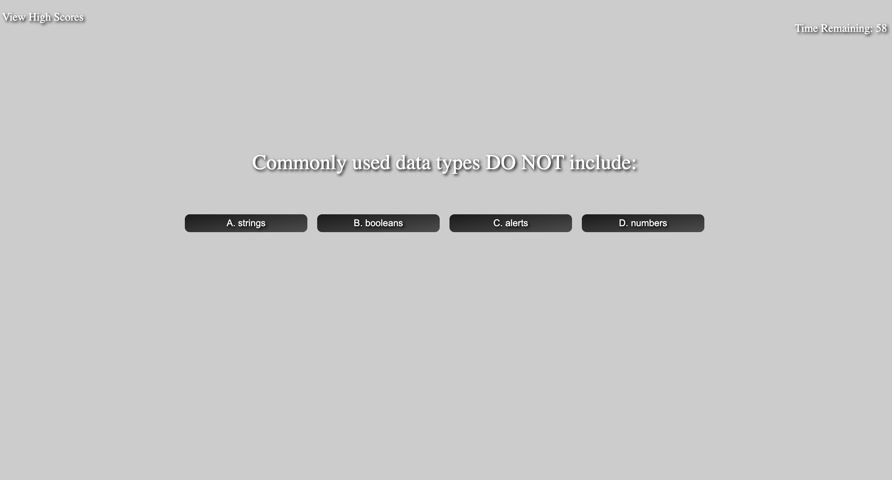

# Code-Quiz

## Purpose
The purpose of this project was to create a timed quiz based around JavaScript fundamentals. Once the user clicked the start button the timer began at 60 seconds. The user is presented with one question on the screen with 4 possible answers for a total of 5 quesitions. When the user answers the question a prompt will display whether the answer was correct or incorrect. If the answer chosen was incorrect, 5 seconds would be subtracted from the timer. Once the all questions were answered or when the timer reached 0 (whichever event occured first) the quiz would end. The user would be presented with thier score which was eqaul to the remaining time on the timer. The user is prompted to enter their initials by inputing atleast one character. Once the user inputs their information the are directed to a page that displays the highscores. The user can then choose to click a button to start the quiz over or another button to delete the highscores displayed.

## Technologies
HTML
CSS
JavaScript

## Webpage Display

## Website Link
https://kaysie04.github.io/Code-Quiz/

## Licenses
MIT